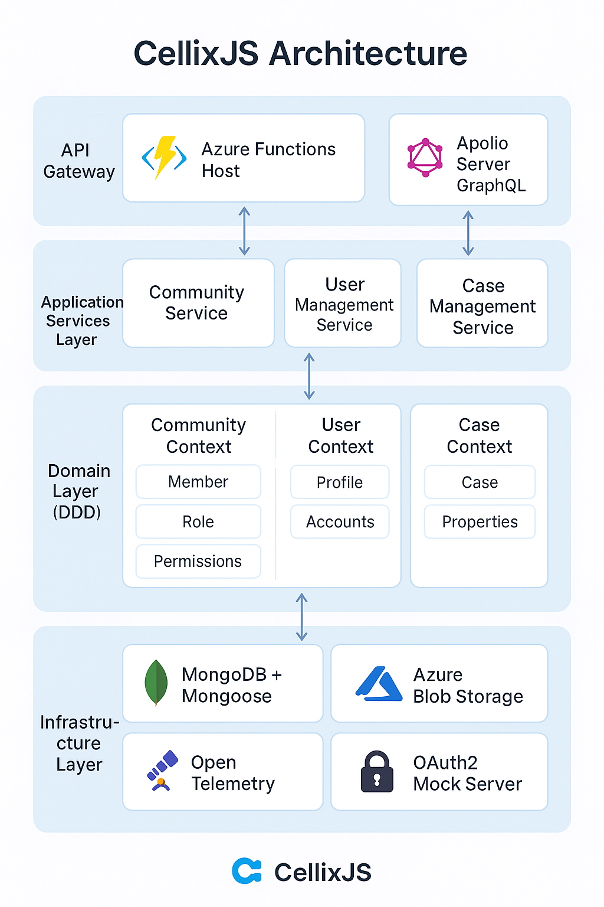

CellixJs documentation features are designed to help developers understand and implement Domain-Driven Design patterns with Azure Functions and modern web technologies.

Here are a few tips to get you started with CellixJs development.

<!-- truncate -->

Simply explore the `apps` and `packages` directories to understand the modular architecture.

Regular contributors can be added to the team through our development workflow.

The project follows semantic versioning and clear release cycles:

- Architecture Decision Records (ADRs) document key decisions
- Domain contexts are organized under `packages/ocom/domain/src/domain/contexts/`

CellixJs provides comprehensive examples for DDD implementation:

The documentation supports categorized content as well!

**Getting Started**: See the Developer Setup guide for full installation and onboarding steps: [Developer setup](/docs/setup)

