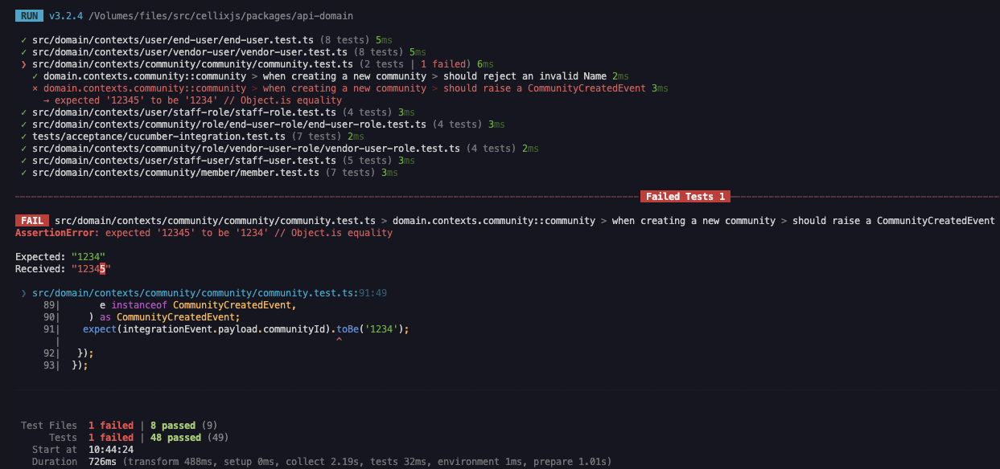
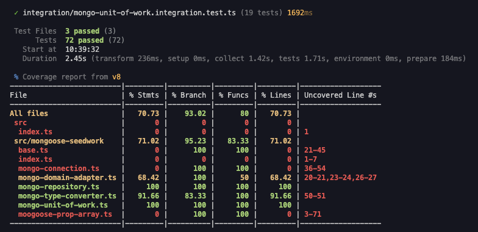

# Select a Test Suite: Jest vs Vitest vs Node

## Context and Problem Statement

The project requires a robust, modern, and maintainable test suite for our TypeScript/JavaScript monorepo. The chosen solution must support the latest TypeScript standards (including ESM), provide strong code coverage capabilities, and integrate smoothly with our multi-package workspace. We aim to streamline the developer experience by enabling tests and coverage to be run per package or across the entire monorepo, with outputs in LCOV format for CI/CD integration. The decision should be documented in a standardized and thorough way to ensure transparency and future reference.

## Decision Drivers

- Compatibility with latest TypeScript standards and practices (ESM, latest TS versions, etc.)
- Ease of installation/configuration as well as customizability and extensibility
- Ability to accommodate significant unit tests for complex business rules in `@ocom/api-domain`
- Ability to accommodate mocking and spying for asserting core functionality in the Cellix framework
- Provides code coverage of unit tests through v8 or an alternative provider
- Supports coverage reporting output in LCOV format
- Performance
- Community support and long-term maintenance

## Considered Options

- [Jest](https://jestjs.io/): Popular, full-featured test runner with strong TypeScript and ESM support, built-in mocking, and code coverage.
- [Vitest](https://vitest.dev/): Modern, Vite-powered test runner with fast performance, ESM-first, and TypeScript support.
- [Node test runner](https://nodejs.org/api/test.html): Built-in Node.js test runner, minimal dependencies, native ESM/TypeScript support (with loader), and basic coverage via `c8`.

## Decision Outcome

Chosen option: **TBD**

No decision has been made yet. The team will conduct a focused evaluation by implementing unit tests for selected domain context files in the `@ocom/api-domain` package using each test suite. This approach ensures a fair comparison and avoids redundant effort. The final decision will be based on the criteria above and the results of this evaluation.

### Consequences

- Good: The selected test suite will improve code quality, maintainability, and developer experience, while supporting modern TypeScript and monorepo workflows.
- Good: Comprehensive code coverage reporting increases developer confidence by making it easier to identify untested areas and ensure that changes do not introduce regressions.
- Bad: Adopting a less mature or less widely adopted test suite may result in missing features or community support issues.

## Validation

### Timing Comparison Table

| Test Suite      | Test Files (Sample) | Test Run Time (s) | Coverage Run Time (s) |
|-----------------|--------------------|-------------------|-----------------------|
| Jest            | @ocom/api-domain   |      2.794        |         3.154         |
| Vitest          | @ocom/api-domain   |      1.129        |         1.903         |
| Node test runner| @ocom/api-domain   |                   |                       |

The timings above are an average of 3 trials on the same machine (MacBook Pro M2 Max 64 GB RAM)
Test Files included in @ocom/api-domain: *community.test.ts*, *member.test.ts*, *end-user-role.test.ts*, *vendor-user-role.test.ts*, *staff-role.test.ts*, *end-user.test.ts*, *staff-user.test.ts*, *vendor-user.test.ts*

### Terminal Output (Developer Usage Experience)
Terminal output for passing and failing tests in each option to compare usability and developer experience

#### Vitest - `npm run test`
*Pass Scenario*
 

 

*Fail Scenario*

#### Vitest - `npm run coverage`

## Pros and Cons of the Options

### Jest

- Good, because it is widely adopted, well-documented, and has strong TypeScript and ESM support.
- Good, because it provides built-in mocking, snapshot testing, and code coverage.
- Good, because it integrates with many tools and CI/CD systems.
- Neutral, because it can be slower on large codebases compared to newer alternatives.
- Bad, because configuration for ESM and latest TypeScript features can be complex.
- Bad, because it may require additional dependencies for monorepo support.

### Vitest

- Good, because it is ESM-first and designed for modern TypeScript projects. Configuration is simple and works with TypeScript out of the box.
- Good, because it delivers high performance, fast test execution, and a familiar Jest-like API to onboard developers quickly.
- Good, because it offers seamless Vite integration, enabling frontend testing in our frontend codebase which leverages Vite.
- Good, because it provides built-in code coverage (e.g. `v8`, `istanbul`) and snapshot testing.
- Good, because it provides a VSCode extension with useful test runner features.
- Neutral, because it is newer and may have less community support than Jest.
- Bad, because the community-supported `@amiceli/vitest-cucumber` package requires a dependency on Vite, and strays from official Cucumber.js package.
- Bad, because it is unable to integrate with SerenityJS for Gherkin-style Cucumber tests. SerenityJS is a separate entity which uses Cucumber runner.

### Node test runner

- Good, because it is built into Node.js, reducing external dependencies.
- Good, because it offers native ESM and TypeScript support (with loader).
- Good, because it can be easily integrated into minimal or custom workflows.
- Neutral, because it provides only basic features out of the box (no built-in mocking, limited reporting).
- Bad, because code coverage requires additional tools (e.g., `c8`), and some features may require custom setup.
- Bad, because community support and documentation are less extensive compared to Jest and Vitest.

## More Information

The team will select one or more domain context files in the `@ocom/api-domain` package to implement unit tests for each test suite. This focused approach ensures a fair comparison and avoids redundant effort. The evaluation will consider developer experience, configuration complexity, performance, and coverage reporting. The final decision will be documented in this ADR after the evaluation is complete.

The team also explored implementing unit tests in the Gherkin style for core Cellix framework functionality, such as AggregateRoot, MonogRepositoryBase, and NodeEventBusImpl. These tests make heavy use of spying and mocking, so the test suites were explored to ensure they could provide the level of functionality we need to have confidence in the complex side effects of our core functionality. The `vitest` package is able to provide the capability for mocking and spying that we need through the `vi` export, which behaves similarly to `jest` export from the `jest` package. 

Additionally, the team explored the possibility of integrating SerenityJS using Cucumber with each test suite's respective Cucumber integration package. For `vitest`, this was a challenge due to `@amiceli/vitest-cucumber` being a community-maintained package which does not adhere to the exports of Cucumber.js, which '@serenity-js/cucumber' adapter expects. Vitest was unsuccessful in its effort to replace the official Cucumber implementation to integrate with SerenityJS. If we choose Vitest, we will have to maintain SerenityJS tests as a separate entity being configured and ran through `@Cucumber/cucumber`.

> For ongoing reference, the team can track the relative adoption and popularity of these tools using [npm trends](https://npmtrends.com/jest-vs-vitest-vs-c8)
