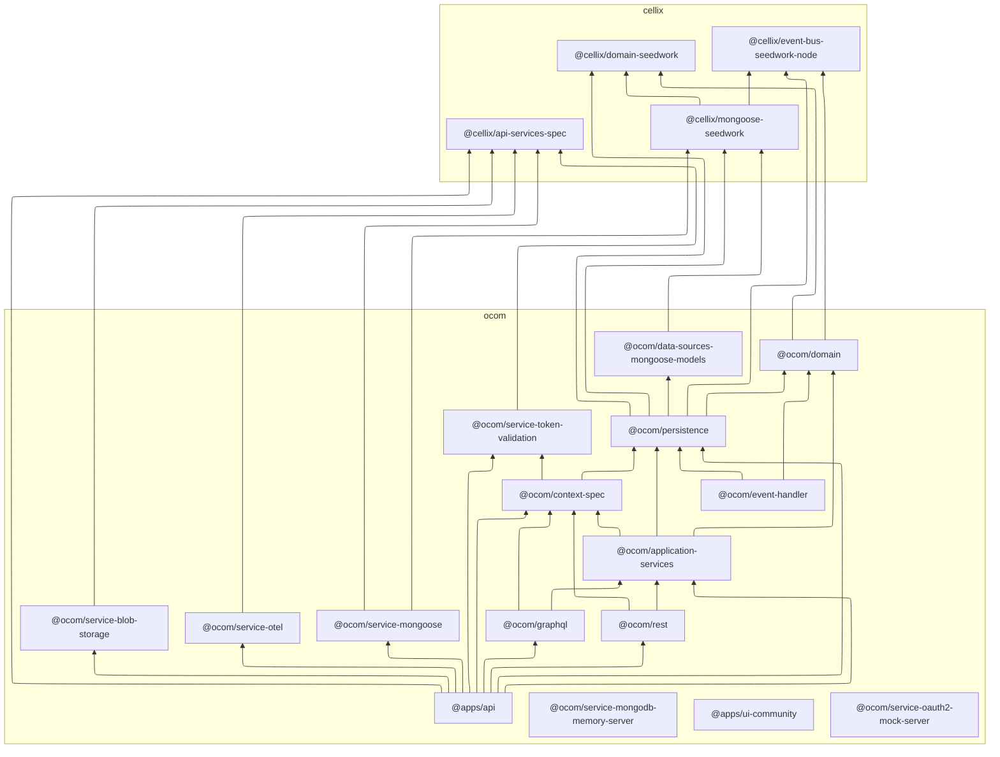

## CellixJS Monorepo

Domain-driven architecture for Azure Functions with GraphQL/REST, MongoDB (Mongoose), and OpenTelemetry. This repo contains the API app, domain, infrastructure, and local dev services.

## Introduction

[Getting Started](https://developers.cellixjs.org/docs/intro):
Our Docusaurus website will help you get started in running and contributing to CellixJS

## Project Status

[](https://sonarcloud.io/summary/new_code?id=simnova_cellix-data-access)

[](https://snyk.io/test/github/CellixJs/cellixjs)

[](https://sonarcloud.io/summary/new_code?id=simnova_cellix-data-access)

[](https://sonarcloud.io/summary/new_code?id=simnova_cellix-data-access)

[](https://sonarcloud.io/summary/new_code?id=simnova_cellix-data-access)

[](https://sonarcloud.io/summary/new_code?id=simnova_cellix-data-access)

[](https://dev.azure.com/simnova/ShareThrift/_build/latest?definitionId=12&branchName=main)


## Developer usage

- Full local dev (builds, starts the portless HTTPS proxy, starts Azurite, and runs the app-level dev servers):

  ```bash
  pnpm run dev
  ```

- Simulate CI pipeline (lints, builds, tests, sonarcloud scan, quality gate):

  ```bash
  pnpm run verify
  ```

- Start only the API development stack:

  ```bash
  pnpm --filter @apps/api run dev
  ```

- Start only the UI development server:

  ```bash
  pnpm --filter @apps/ui-community run dev
  ```

- Start only the docs development server:

  ```bash
  pnpm --filter @apps/docs run dev
  ```

- Start only the local mock services:

  ```bash
  pnpm --filter @apps/server-oauth2-mock run dev
  pnpm --filter @apps/server-mongodb-memory-mock run dev
  ```


Mock OIDC server

The local mock OpenID Connect provider used for UI development is configured per-portal via JSON files placed in the UI app directories.

- Location: apps/ui-*/mock-oidc.json
- Schema:
```json
{
  "name": "account-portal",
  "envVars": {
    "clientId": "VITE_ACCOUNT_PORTAL_OIDC_CLIENT_ID",
    "redirectUri": "VITE_ACCOUNT_PORTAL_OIDC_REDIRECT_URI"
  },
  "claims": {
    "sub": "00000000-0000-4000-8000-000000000001",
    "email": "dev@example.com",
    "given_name": "Dev",
    "family_name": "User",
    "roles": ["Owner"]
  }
}
```

The envVars values are environment variable names (from the UI app's `.env` file) that the server resolves to actual values at startup.

Per-developer overrides

If you need to override claims for local testing, create a file named mock-oidc.local.json alongside mock-oidc.json in the UI app directory. This file is git-ignored and merges claim values into the base mock-oidc.json at startup.

Adding a new portal

To add a new UI portal for local mock auth, create a directory apps/ui-<name> and add a mock-oidc.json file with the schema above. The mock server auto-discovers portals on startup.

PORT and BASE_URL

The mock auth server now runs as a single instance. Configure it using the following environment variables:

- PORT — port the HTTP server listens on (default: 1355)
- BASE_URL — externally visible origin used as the OIDC issuer (in local development this is handled by the Portless dev proxy; set BASE_URL to the proxy origin when necessary)

Per-portal port allocation (PORT_BASE) is no longer used.


## Scripts

- Build all workspaces: `pnpm run build`
- Build affected packages only: `pnpm run build:affected`
- Lint all: `pnpm run lint`
- Lint affected packages only: `pnpm run lint:affected`
- Format all: `pnpm run format`
- Tests: 
    - `pnpm run test`
    - `pnpm run test:affected` (affected packages only)
    - `pnpm run test:coverage`
    - `pnpm run test:coverage:affected` (affected packages only)
    - `pnpm run test:integration`
    - `pnpm run test:serenity`
    - `pnpm run test:unit`
    - `pnpm run test:watch` (typically run per workspace package)
- Verify build locally: `pnpm run verify`

## Turborepo Optimization

This monorepo uses [Turborepo](https://turbo.build/) for optimized builds and testing:

- **Selective Builds**: Only affected packages are built/tested in CI
- **Remote Caching**: Shared build cache across team and CI (if configured later)
- **Local Caching**: Faster subsequent builds on your machine
- **Package Categories**: 
  - Frontend: `ui-*` packages
  - Backend: All other packages (excluding mock servers)

For detailed setup and usage, see [TURBOREPO.md](TURBOREPO.md).

## Agent Skills

CellixJS integrates [Agent Skills](https://agentskills.io) to provide AI coding assistants with structured, project-specific context for enforcing architectural standards defined in our MADRs.

The managed skill set lives in [`.agents/skills/`](.agents/skills/) and is mirrored for Copilot discovery through symlinks in [`.github/skills/`](.github/skills/). Only skills relevant to normal work in this repo are committed.

**Current managed skills:**
- **madr-enforcement**: Enforces ADR-defined architectural standards across the codebase
- **turborepo**: Guides monorepo task graph, caching, and pipeline work
- **vitest**: Guides test structure, mocking, filtering, and coverage work
- **ant-design** and **antd**: Support Ant Design component usage and `@ant-design/cli` workflows for UI work
- **mongodb-connection**: Guides MongoDB/Mongoose connection and pool tuning
- **mongodb-mcp-setup**: Guides MongoDB MCP configuration and troubleshooting for the local MCP workflow
- **mongodb-query-optimizer**: Guides MongoDB query and index performance work
- **mongodb-schema-design**: Guides MongoDB schema and modeling decisions for Mongoose models

**MongoDB MCP support:**
- Workspace MCP configuration is committed in [`.vscode/mcp.json`](.vscode/mcp.json)
- Local development can target the in-memory replica set started by `pnpm run start-emulator:mongo-memory-server`

**Community install metadata:**
- `skills-lock.json` records the upstream source and hash for each installed community skill

**Learn more:** See [.agents/skills/README.md](.agents/skills/README.md) and [ADR-0024](apps/docs/docs/decisions/0024-madr-agent-skills.md)

## Decisions

- Architecture docs and ADRs in `apps/docs/docs/decisions`

## In Progress ADRs

| ADR | ADR Status | GitHub Issue Status | Date Added |
| --- | --- | --- | --- |
| [0030 TypeScript 7.0 Upgrade](https://developers.cellixjs.org/docs/decisions/typescript-7-upgrade) | accepted | in progress | 2025-07-17 |

> Monitored ADRs require weekly GitHub issue check-ins; see the ADR’s “Weekly Reassessment” section for the linked blockers to review each week.

## VS Code tips

- Install recommended VSCode extensions for best developer experience.
- Use built-in tasks to run the Functions host and watch builds.

## Deployment

### Conditional Deployments

The CI/CD pipeline uses intelligent change detection to deploy only affected components:

- **Backend/API**: Deploys when API-related packages change
- **Frontend/UI**: Deploys when UI packages change  
- **Docs**: Deploys when documentation changes
- **Infrastructure**: Deploys when Bicep templates, pipeline configs, or infrastructure code changes

### Forcing Full Deployments

In rare cases where external Azure DevOps configuration changes need deployment (variable groups, service connections, environment settings), or when you want to manually force deployment of specific packages, use the force deploy mechanism:

#### Force Deploy Script

The `.force-deploy` file is a configuration file that sets environment variables to control manual deployment overrides:

```bash
#!/bin/bash
# .force-deploy configuration file for CellixJS monorepo
# Set FORCE_DEPLOY_* flags to control manual deployment overrides
# Set to 'true' to force deployment, 'false' to disable

FORCE_DEPLOY_API=false
FORCE_DEPLOY_UI=false
FORCE_DEPLOY_DOCS=false

# Developers: Change any value to 'true' to force deployment of that package
# Example:
# FORCE_DEPLOY_API=true
# FORCE_DEPLOY_UI=true
# FORCE_DEPLOY_DOCS=true
```

**To force deployment of specific packages:**
1. Edit `.force-deploy` and set the desired `FORCE_DEPLOY_*` variable(s) to `true`
2. Commit and push the changes to trigger the pipeline
3. The pipeline will deploy the selected packages even if no changes are detected
4. Optionally reset the variables to `false` after successful deployment

**Important**: The pipeline parses this file directly and respects the `FORCE_DEPLOY_*` variables, overriding change detection logic for the specified packages.

## Dependency Graph


```mermaid
---
config:
    layout: elk
---
flowchart BT
  %% Keep two top-level groups for clarity
  subgraph ocom
    direction TB
    %% API and services
    ocom_api["@apps/api"]
    ocom_api_graphql["@ocom/graphql"]
    ocom_api_rest["@ocom/rest"]
    ocom_api_application_services["@ocom/application-services"]
    ocom_api_context_spec["@ocom/context-spec"]
    ocom_api_event_handler["@ocom/event-handler"]
    ocom_api_domain["@ocom/domain"]
    ocom_api_persistence["@ocom/persistence"]
    ocom_api_ds_mongoose_models["@ocom/data-sources-mongoose-models"]

    %% Infra services (OCom)
    ocom_service_mongoose["@ocom/service-mongoose"]
    ocom_service_blob_storage["@ocom/service-blob-storage"]
    ocom_service_otel["@ocom/service-otel"]
    ocom_service_token_validation["@ocom/service-token-validation"]

    %% Local dev + UI
    ocom_service_oauth2_mock_server["@ocom/service-oauth2-mock-server"]
    ocom_service_mongodb_memory_server["@ocom/service-mongodb-memory-server"]
    ocom_ui_community["@apps/ui-community"]
  end

  subgraph cellix
    direction TB
    cellix_api_services_spec["@cellix/api-services-spec"]
    cellix_data_sources_mongoose["@cellix/mongoose-seedwork"]
    cellix_domain_seedwork["@cellix/domain-seedwork"]
    cellix_event_bus_seedwork_node["@cellix/event-bus-seedwork-node"]
  end

  %% Dependencies (left -> right for cleaner routing)
  %% Cellix base
  cellix_data_sources_mongoose --> cellix_domain_seedwork
  cellix_data_sources_mongoose --> cellix_event_bus_seedwork_node

  %% OCom -> Cellix
  ocom_api_ds_mongoose_models --> cellix_data_sources_mongoose
  ocom_api_domain --> cellix_domain_seedwork
  ocom_api_domain --> cellix_event_bus_seedwork_node
  ocom_api_persistence --> cellix_domain_seedwork
  ocom_api_persistence --> cellix_event_bus_seedwork_node
  ocom_api_persistence --> cellix_data_sources_mongoose
  ocom_service_mongoose --> cellix_api_services_spec
  ocom_service_mongoose --> cellix_data_sources_mongoose
  ocom_service_blob_storage --> cellix_api_services_spec
  ocom_service_otel --> cellix_api_services_spec
  ocom_service_token_validation --> cellix_api_services_spec

  %% OCom internal
  ocom_api_persistence --> ocom_api_domain
  ocom_api_persistence --> ocom_api_ds_mongoose_models
  ocom_api_context_spec --> ocom_api_persistence
  ocom_api_context_spec --> ocom_service_token_validation
  ocom_api_application_services --> ocom_api_context_spec
  ocom_api_application_services --> ocom_api_domain
  ocom_api_application_services --> ocom_api_persistence
  ocom_api_event_handler --> ocom_api_domain
  ocom_api_event_handler --> ocom_api_persistence
  ocom_api_graphql --> ocom_api_application_services
  ocom_api_graphql --> ocom_api_context_spec
  ocom_api_rest --> ocom_api_application_services
  ocom_api_rest --> ocom_api_context_spec

  %% Composition
  ocom_api --> cellix_api_services_spec
  ocom_api --> ocom_api_context_spec
  ocom_api --> ocom_api_application_services
  ocom_api --> ocom_api_graphql
  ocom_api --> ocom_api_persistence
  ocom_api --> ocom_api_rest
  ocom_api --> ocom_service_blob_storage
  ocom_api --> ocom_service_mongoose
  ocom_api --> ocom_service_otel
  ocom_api --> ocom_service_token_validation

  %% Keep these as standalone to avoid clutter
  ocom_service_oauth2_mock_server
  ocom_service_mongodb_memory_server
  ocom_ui_community
```

## Recipe History

This section preserves prior setup notes and commands for reference as the repo evolved.

```bash
npm i -D concurrently

npm init -w ./packages/api-graphql
npm install @as-integrations/azure-functions @apollo/server graphql @azure/functions -w api-graphql

npm init -w ./packages/api-event-handler

npm init -w ./packages/api-services
npm init -w ./packages/api-rest
npm install @azure/functions -w api-rest

npm init -w ./packages/api-data-sources-domain

npm init -w ./packages/service-otel
npm install @azure/monitor-opentelemetry -w service-otel

npm init -w ./packages/api-persistence

npm init -w ./packages/event-bus-seedwork-node

npm install --save-dev @tsconfig/node20 @tsconfig/node-ts vitest @vitest/coverage-istanbul
```

## Your feedback matters!

Do you find CellixJS useful? [Give us a ⭐ star on GitHub](https://github.com/cellixjs/cellixjs)!

[](https://github.com/cellixjs/cellixjs)

Found a bug? Need a feature? Raise [an issue](https://github.com/cellixjs/cellixjs/issues?state=open)
or submit a pull request.

Have feedback? Leave a comment in [CellixJS discussions on GitHub](https://github.com/cellixjs/cellixjs/discussions)


## Thanks to all our contributors

[](https://github.com/cellixjs/cellixjs/graphs/contributors)

[⬆ Back to Top](#table-of-contents)
